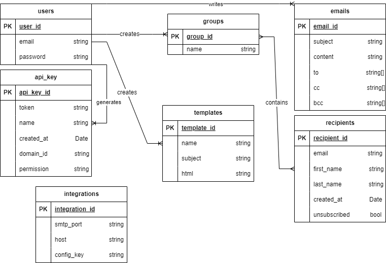

# Entity-Relationship Model

## Overview

This document provides an overview of the Entity-Relationship (ER) model for our database. The ER model illustrates the key entities, relationships, and attributes that form the structure of our database.

## ER Diagram

*Figure 1: Entity-Relationship Diagram*

The above diagram provides a visual representation of the entities and their relationships within the database.

## ER Model JSON

For a detailed, machine-readable representation of the ER model, please refer to the [ER Model JSON file](./EtherealPulseSchema.json).

The JSON file contains all the entities, their attributes, and the relationships in a structured format.
